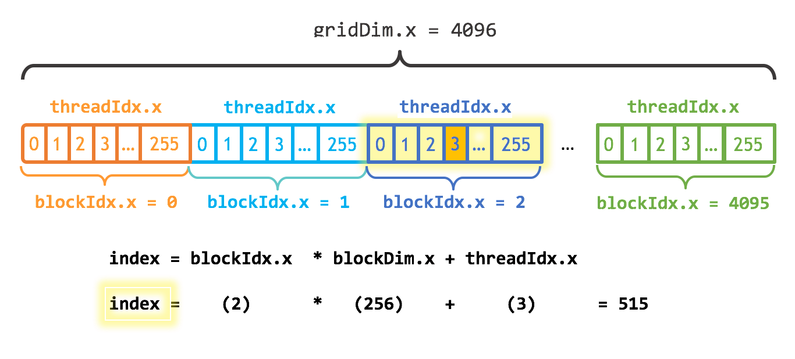

# Overview

CUDA GPUs run kernels using blocks of threads that are a multiple of 32 in size.

# Grids, blocks and threads

CUDA GPUs have many parallel processors grouped into Streaming Multiprocessors (SMs). Each SM can run multiple concurrent thread blocks, but each threa block runs on a single SM.

<figure>
  
  <figcaption>Grid, Block and Thread indexing in CUDA kernels (one-dimensional).</figcaption>
</figure>

`gridDim.x` contains the number of blocks in the grid. `blockIdx.x` contains the index of the current thread block in the grid.

The idea is that each thread gets its index by computing the offset to the beginning of its block (`blockIdx.x * blockDim.x`) and adding the thread’s index within the block (`threadIdx.x`).

# Warp

**Warp** is a group of $32$ threads being executed in one _Streaming Multiprocessor_ (SM).

When you launch a kernel with a number of blocks, GPU splits each block into multiple warps. All threads in the same **warp** execute the same instruction (_SIMT_ or _single instruction, multiple threads_).

### Branch divergence issue

When every threads in the same warp take different branches (`if`/`else`), the GPU must execute each branch **sequentially** — threads that don't take that branch will be **idle**.

```c++
// Cause branch divergence
if (threadIdx.x % 2 == 0) {
    // Only threads with even id run -> cause threads with odd id idle
    doSomething();
} else {
    // Only threads with odd id run -> cause threads with even id idle
    doOther();
}

// Better: Branching by warp boundary (multiples of 32)
if (threadIdx.x < 32) {
    doSomething(); // all threads of warp 0 run
}

```

### Warp scheduling

Each SM can contain multiple active warps. When a warp is waiting for memory (latency), SM will switch to another warp to hide memory latency.

SM has 4 warps:

- Warp A: waiting for global memory -> PAUSE
- Warp B: executing -> EXECUTE
- Warp C: waiting for shared memory -> PAUSE
- Warp D: ready to execute -> READY

# Tile programming

Tile programming utilizes GPU Shared Memory to cache data locally within a block, drastically reducing high-latency Global Memory (VRAM) access. In this pattern, all threads in a block cooperatively load a tile (e.g., $16 \times 16$ or $32 \times 32$ elements) into Shared Memory. During the loading phase, because threads access contiguous memory addresses, the hardware performs **Memory Coalescing**, grouping up to 32 requests into a single high-bandwidth 'burst' transfer. Once the tile is loaded, the data is reused multiple times by all threads in the block at near-register speeds.

# Bank Conflicts
